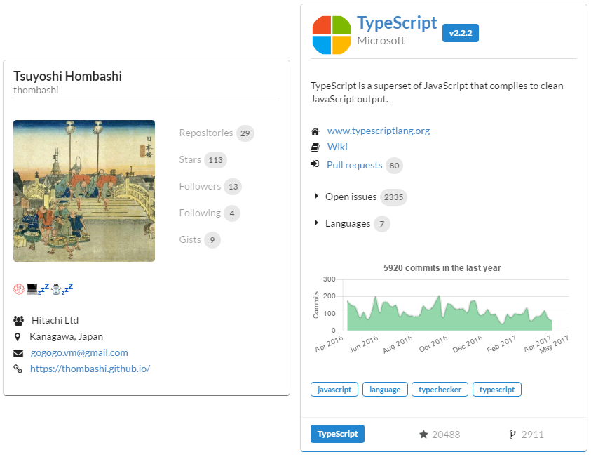

ghscard
=======

.. image:: https://img.shields.io/travis/thombashi/ghscard/master.svg?label=Linux
    :target: https://travis-ci.org/thombashi/ghscard

.. image:: https://img.shields.io/github/stars/thombashi/ghstaticcard.svg?style=social&label=Star
   :target: https://github.com/thombashi/ghscard

Summary
-------

A JavaScript widget to generate GitHub user/repository/organization cards for static web pages (like GitHub pages).

Not executed GitHub API
avoid GitHub API rate limitation.

Quick Start
================

CLI Tool Installation
----------------------------------
Install ``ghscard`` CLI tool from `PyPI <//pypi.python.org/pypi>`__ via
`pip <//pip.pypa.io/en/stable/installing/>`__ (Python package manager) command.

::

    pip install ghscard

Generate card data files
----------------------------------
Execute ``ghscard gen`` command to generate a GitHub user/organization/repository card data file.

.. code:: pycon

    ghscard gen thombashi -o data
    [INFO] ghscard gen: written repository data to 'data/thombashi.json'

Add widget to a HTML file
----------------------------------

.. code:: html

    <!doctype html>
    <html>
    <body>
        

        
    </body>
    </html>

This HTML will be displayed as follows:

Demo
====

- `Popular Repositories on GitHub <https://thombashi.github.io/ghscard/demo/>`__
- https://thombashi.github.io/

Dependencies
============

CLI Tool Dependencies
----------------------
Python 2.7+ or 3.3+

- `appconfigpy <//github.com/thombashi/appconfigpy>`__
- `click <//github.com/pallets/click>`__
- `logbook <//logbook.readthedocs.io/en/stable/>`__
- `pathvalidate <//github.com/thombashi/pathvalidate>`__
- `PyGithub <//pygithub.github.io/PyGithub/v1/index.html>`__
- `requests <//python-requests.org/>`__
- `typepy <//github.com/thombashi/typepy>`__
- `six <//pypi.python.org/pypi/six/>`__

Documentation
=============

http://ghscard.rtfd.io/

